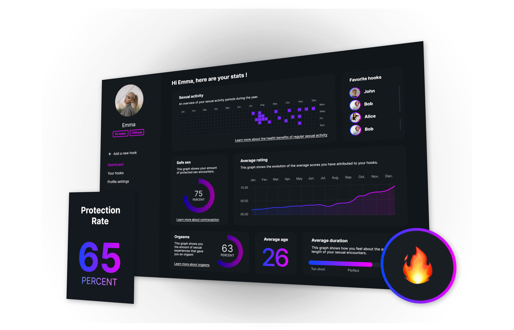

# HOOKS

This project was completed in one week by our group of 3: Sam Sinz, Olympe Lespagnon and Justine Sarzi. We succeeded to deploy the platform even if we wished to have more time to implement more features.

Hooks is currently a desktop app but we hope in the future to develop the mobile app.

Hooks allows you to track your sexual well-being! Users can open an account and enter every person whith who they had an activity ('Kissing', 'Foreplay' and 'Sex') and give more information about the rate, the place if they had an orgasm but most of all if they had a protected relation.
Every relation are called 'Hook' and they can add different hooks to the same partner to see the evolution of the time. Thanks to the dashboard the users can have an overall of all their relations. The user will 'win' achievement after entering some information (for exemple: 10 relations with protection....)

## DEMO
## [Link to the App](https://my-hooks.netlify.app/)

## About the implementation

We did the following:

- 4 relational data models: User / Partner / Hook / Achievements
- Handle account creation
- Handle profile changes and update database (profile picture, birthdate and name)
- Entering data about a person and a relation
- Having an overview of all the data with an average
- A database on Mongoose Atlas 
- Deployment on Render for the backend and Netlify for the frontend

## Possible improvements

- Deploy as Mobile App
- Reload the page automatically 
- App responsive
- Having a notification when you unlock an achievement 

